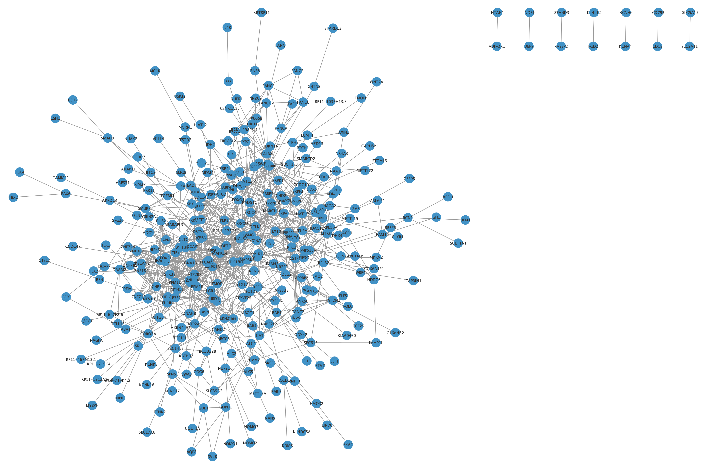

#  CPBS Module1 Day3 Assignment 

## Overview
The python script generates three subnetworks: 
a) subnetwork1: Generates a network connecting genes from different loci (excludes genes from the same loci) 
b) subnetwork2: Generates a network connecting genes from same and different loci  
c) subnetwork3: Generates network by including all disease genes and non-disease genes that connect disease genes (that form a network path)

## Input files

There are two input files:  
a) Disease genes file in Gene Map Table (GMT) format from OMIM  
b) Protein protein interactions network, for example, from STRING database. Column1 is gene1, column2 is gene2, column3 is edge

## Output files

Creates three output files - subnetwork1.txt, subnetwork2.txt, and subnetwork3.txt

## Usage

`python Subnetworks.py Disease_gene_file.txt Protein_Protein_Interaction.txt`

Example:

`python Subnetworks.py Input.gmt.txt STRING 1.txt`

## Downstream Visualization

subnetworks can be imported into cytoscape for visualizing the network. Figure below shows subnetwork1 in cytoscape.

## Additional Documentation

https://docs.google.com/document/d/1e4QE52YtsbcNDIFcro7jvEprO1R6IrutlsCBmicf1xc/edit?usp=sharing
