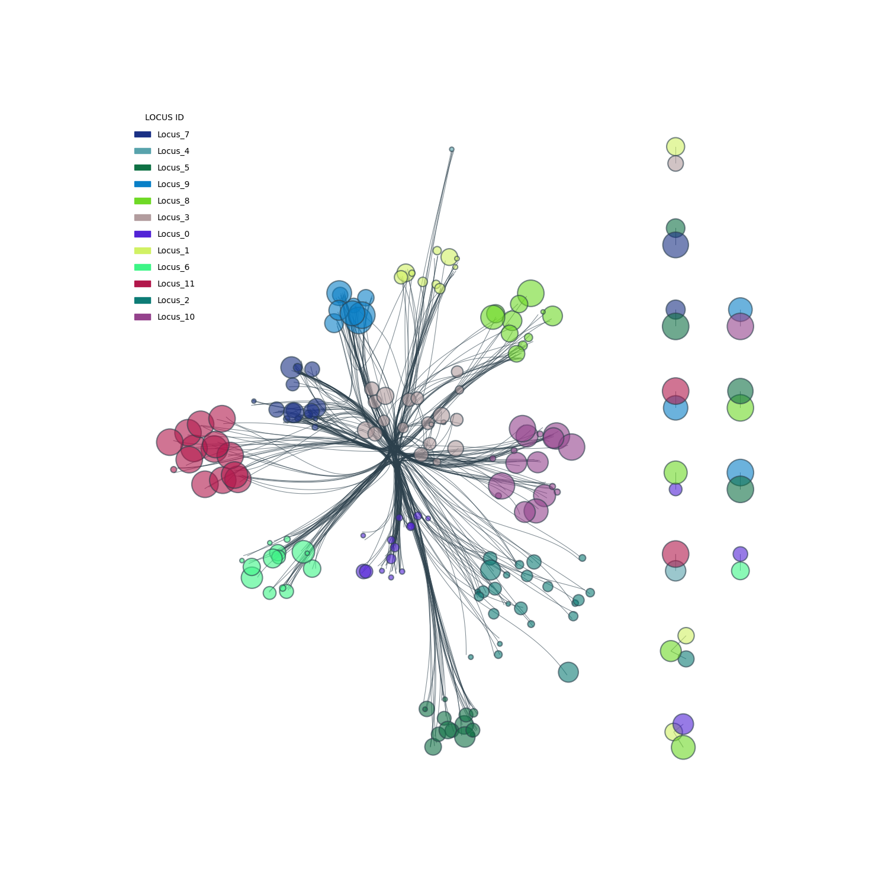
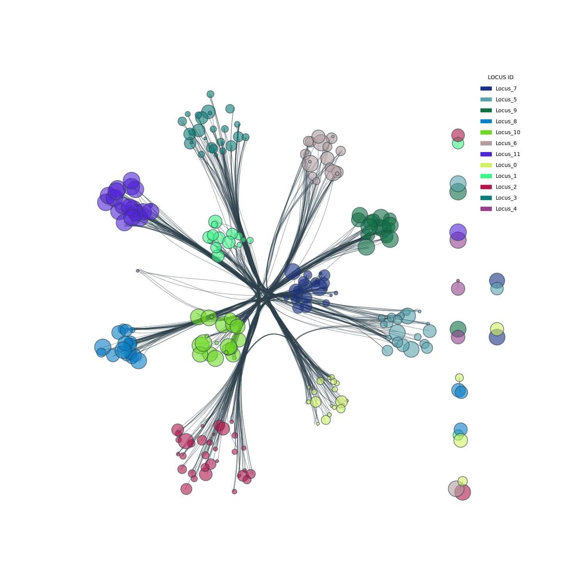

#  CPBS Module3 Day3 Assignment 

## Overview
The python script generates a population of subnetworks and generates gene scores: 
- Generate 5000 random subnetworks with disease associated genes (one gene from each loci)
- Compute raw candidate gene scores by replacing the representative gene with every other gene in the loci and calculating the total number of edges
- Compute empty case by counting the number of edges without the current loci
- Subtract raw candidate gene scores with the empty case
- Compute the average gene scores across 5000 subnetworks for all the genes
- If a gene doesn't exist in the parent subnetwork, give it an 'NA' score

## Input Arguments

There are two input files:  
- -i or --input: Disease genes file in Gene Map Table (GMT) format from OMIM  
- -n or --network: Protein protein interactions network, for example, from STRING database. Column1 is gene1, column2 is gene2, column3 is edge 

Arguments:
- nSub: Number of subnetworks. Default is 5000  
- minEdges: Number of minimum Edges for the subnetwork to be considered. Default is 0  
- nSubViz: First N subnetworks to visualize. Default is 200  

## Output files

- network.png
- FA_subnetwork.txt
- gene_scores.txt
- GeneScore_Distribution.png

## Usage

`python Subnetworks_GeneScore.py Disease_gene_file.txt Protein_Protein_Interaction.txt --nSub --minEdges --nSubViz`

Example:

`python Subnetworks.py Input.gmt.txt STRING 1.txt --nSub 5000 --minEdges 0 --nSubViz 200`

## First 200 subnetworks

The network visualization below shows first 200 subnetworks combined. Nodes are color coded by LociID shown in the legend and size of the node indicates the log10 normalized average gene scores. 

First 200 subnetworks  
 

 

First 500 subnetworks  
 

## Additional analysis

- For summary statistics on gene scores use genescores.py

## Additional Documentation 

https://docs.google.com/document/d/1TbVRrIFTITzxvrPdeLbh282QBcfuMC313u7lxWaopnc/edit?usp=sharing
